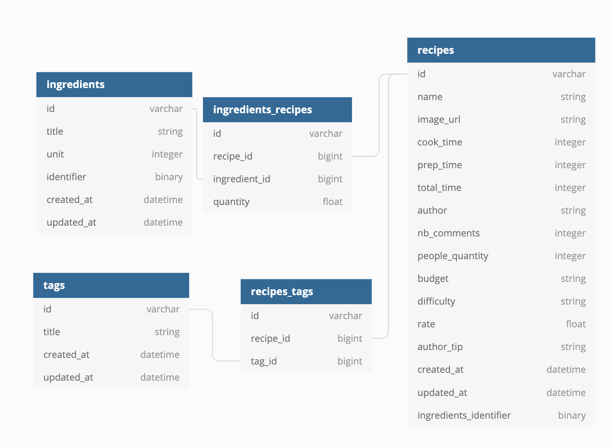

# README

Setup steps:

1. Setup the database, by running

   ```bash
   rake db:create db:migrate
   ```
2. Run the seeds to add recipes, ingredients and tags

   ```bash
   rake db:seed
   ```
3. Run the following rake task to add identifiers to ingredients (the most used ingredient will have the lowest identifier value)

   ```bash
   rake compute_ingredients_identifiers
   ```
4. Run the following rake task to add the ingredients identifier to the recipes - this identifier represents the OR operation of each ingredient identifier the recipe contains

   ```bash
   rake compute_recipe_ingredients_identifier
   ```

To start the app, just run `rails s`

If you want to do live changes in the UI, also run `./bin/webpack-dev-server`

You can also access the app the the following link: [Heroku App](https://dish-suggestion-pennylane.herokuapp.com/)

Database Structure: 
